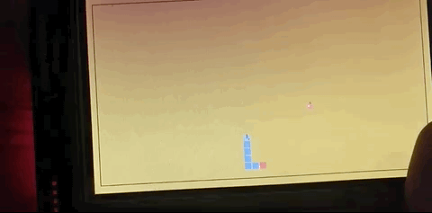

# Multi-Snake-stm32f7-Rust
Multiplayer Snake for stm32f7 written in Rust





## Build + Run
**PLS**:  
rename either `.gdbinitv7` or `.gdbinitv8` to `.gdbinit` depending on your gdb version.

On Linux/Mac:

```bash
# build: (cross-compile for stm)
RUST_TARGET_PATH=$(pwd) xargo build
# run
sh gdb.sh
# wait for it
semihosting-enable
c # continue
# CTRL+C
# q (quit)
```
